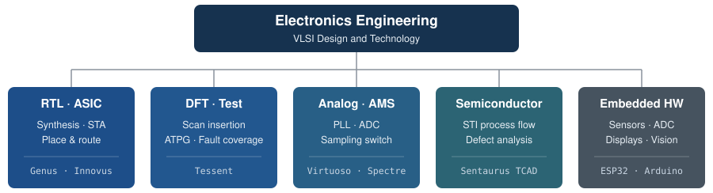

# Hi, I'm Tanisha Gupta

**Electronics Engineering (VLSI Design and Technology) · Vellore Institute of Technology, Vellore**

Electronics Engineering student working across RTL design, ASIC implementation, DFT/testing, semiconductor process simulation, analog IC design, and embedded hardware.

I design digital blocks in Verilog and take them through Cadence synthesis, static timing analysis, and place-and-route. I also insert scan chains and run ATPG with Siemens Tessent, simulate STI fabrication in Synopsys Sentaurus, and design transistor-level PLL and sampling circuits in Cadence Virtuoso. My lead project, a [low-power IEEE-754 floating-point adder](https://github.com/Tanisha110705/Power-Optimized-IEEE754-FP-Adder), was presented as a paper at an IEEE conference in 2026.

  

## About Me

- **B.Tech Electronics Engineering, VLSI Design and Technology** at VIT Vellore (2023 – present, CGPA 8.76/10)
- Most of my work is front-end and back-end digital IC design: RTL, synthesis, STA, scan insertion, and ATPG on Cadence and Siemens flows
- Lab and course work on 45 nm, 65 nm, and 180 nm technology libraries, plus an analog and TCAD track in parallel
- Hardware internships at **IIT Delhi** and **SPG Life Green Energy**, building ESP32 systems with sensors, ADCs, and displays

## Core Areas

| Digital / ASIC | DFT / Testing | Analog / Mixed Signal |
|---|---|---|
| Verilog RTL · FSM control · pipelined datapaths · logic synthesis · static timing analysis · floorplan → CTS → route · gate-level simulation · LEC | Scan insertion · scan-chain stitching and balancing · DFT rule checks · stuck-at and transition ATPG · fault coverage · pattern compaction | MOS characterization · gm/Id sizing · current mirrors · CS / cascode / active-load amplifiers · charge-pump PLL · two-step flash ADC · bootstrapped sampling switch |
| **Semiconductor Technology** | **Embedded Hardware** | **Computer Vision** |
| STI process simulation · trench etch, fill, and CMP · cone/spike defect formation · oxide thinning · field-enhancement and reliability effects | ESP32 and Arduino · ADC and voltage-divider sensing · current, proximity, and biosignal sensors · seven-segment display driving · Wi-Fi/NTP time sync | YOLOv8 object detection · OpenCV · custom dataset collection · good/defective part inspection |

## Technologies

| Area | Tools |
|---|---|
| **HDL / Languages** | Verilog · SystemVerilog · C · C++ · Python · MATLAB · Tcl · Perl |
| **Digital Implementation** | Cadence Genus · Cadence Innovus · Cadence Tempus · Cadence Conformal LEC · Synopsys Design Compiler |
| **Simulation** | Cadence Xcelium / SimVision · ModelSim · Questa Sim |
| **DFT / Test** | Siemens Tessent · Atalanta ATPG |
| **Analog / Custom** | Cadence Virtuoso (ADE L, Spectre, Layout XL) · Calibre DRC |
| **TCAD** | Synopsys Sentaurus Process · Sentaurus Visual |
| **Embedded / Vision** | ESP32 · Arduino · PlatformIO · KiCad · OpenCV · YOLOv8 |

## Featured Projects

### ⭐ [Power-Optimized IEEE-754 Floating-Point Adder](https://github.com/Tanisha110705/Power-Optimized-IEEE754-FP-Adder)

32-bit single-precision FP adder with a dual-path FAR/CLOSE datapath. Explicit operand isolation stops the unused path from switching.

- **Results (vs. single-path baseline, GPDK 45 nm, 200 MHz):** **10.9% lower switching power** · **15.0% lower cell area** · **+1550 ps setup slack**, timing met
- **Verification:** 1,000 random + 4 directed corner-case vectors, 0 mismatches. A VCD activity dump drives the power analysis
- **Tools:** Verilog · Cadence Xcelium · Cadence Genus (synthesis + STA)
- **Paper:** presented at IEEE SPAC-AID 2026

### [FSM-Based 8-bit Divider: RTL to GDS](https://github.com/Tanisha110705/fsm-divider-rtl)

8-bit unsigned sequential divider with a `start`/`done` handshake, taken from RTL to a routed layout.

- **Front end ([RTL-of-8-bit-Divider](https://github.com/Tanisha110705/RTL-of-8-bit-Divider)):** Genus synthesis met a 650 ps clock in baseline, clock-gated, and physical-aware runs. SDF-annotated gate-level simulation passed, and Conformal LEC showed 64/64 points equivalent
- **Back end ([ASIC-implementation-of-8-bit-divider](https://github.com/Tanisha110705/ASIC-implementation-of-8-bit-divider)):** Innovus floorplan → placement → CTS → routing. Then DRC and connectivity checks, SPEF extraction, and Tempus STA with 0 failing setup or hold paths
- **Tools:** Verilog · Genus · Innovus · Tempus · Xcelium · Conformal

### [RISC-V Core DFT: Scan Insertion and ATPG](https://github.com/Tanisha110705/riscv-dft-atpg)

DFT flow on a gate-level RISC-V core synthesized to a TSMC 65 nm library.

- **Scan:** 2,319 flip-flops stitched into 5 balanced chains (464/464/464/464/463), with lockup latches and scan ports added
- **ATPG (lab scan netlist):** stuck-at test coverage 100% (fault coverage 97.82%); transition test coverage 85.95%
- **Tools:** Synopsys Design Compiler · Siemens Tessent · Questa Sim

### [STI Process Simulation and Cone Defect Analysis](https://github.com/Tanisha110705/sti-tcad-cone-defect)

TCAD study of shallow trench isolation and a micromasking-induced cone defect in an educational 180 nm process.

- Simulates the pad oxide → nitride mask → trench etch → HDP oxide fill → CMP flow, and studies how the cone defect forms
- Covers local oxide thinning and why it raises field enhancement and dielectric-reliability risk
- **Tools:** Synopsys Sentaurus Process · Sentaurus Visual

### [Full-Custom Charge-Pump PLL](https://github.com/Tanisha110705/pll-cadence-virtuoso)

Transistor-level PLL in 180 nm CMOS: dynamic PFD, current-starved ring VCO, charge pump, passive loop filter, and ÷128 divider.

- VCO tuned from **107 MHz to 4.21 GHz** in simulation. The loop targets 128 × 20 MHz = 2.56 GHz
- Full-custom layout of every block, checked with Calibre DRC
- **Tools:** Cadence Virtuoso · Spectre · Layout XL · Calibre

### [8-bit Two-Step Flash ADC](https://github.com/Tanisha110705/two-step-flash-adc)

Behavioral model of a sub-ranging ADC: 4-bit coarse flash, DAC, ×16 residue, and 4-bit fine flash.

- Uses **30 comparators, against 255 for a full 8-bit flash**. All 256 codes present, with no missing codes
- DNL/INL extraction, including an analysis showing the residual error comes from the input-sweep step size
- **Tools:** MATLAB · GNU Octave · Python

### [ESP32 Safety Wearable](https://github.com/Tanisha110705/esp32-safety-wearable) · 🏆 First Prize, HerZion Ideathon 2025

ESP32 prototype that combines ECG, GSR, and PIR sensing with a panic button, rule-based event detection, LED status, and emergency notification over Wi-Fi.

- **Tools:** ESP32 · C++ (Arduino / PlatformIO) · ADC sampling · sensor interfacing

### [Power Line Fault Detection](https://github.com/Tanisha110705/Power-Line-Fault-Detection)

Low-voltage lab prototype that detects open-circuit, overcurrent, and obstacle conditions.

- Uses an ACS712 current sensor (averaged over 100 samples) and an HC-SR04 proximity sensor, with LCD/LED status, MATLAB logging, and a YOLOv8 camera module for person detection
- **Tools:** Arduino · Embedded C/C++ · MATLAB · YOLOv8

## Selected Results

| Result | Project |
|---|---|
| −10.9% switching power, −15.0% cell area | IEEE-754 FP adder (Genus, 45 nm) |
| +1550 ps setup slack at 200 MHz, 1,004 vectors with 0 errors | IEEE-754 FP adder |
| 0 failing setup/hold paths after routing (Tempus) | 8-bit divider |
| 2,319 flip-flops → 5 scan chains, 1-cell length spread | RISC-V DFT |
| 44.1% fewer test patterns after compaction across 4 ISCAS-85 circuits | [VLSI Testing ATPG](https://github.com/Tanisha110705/vlsi-testing-atpg) |
| 107 MHz – 4.21 GHz VCO tuning range | Full-custom PLL |
| Ron 52.5–55.1 Ω (±2.4%) over input range, −67.17 dB THD at 7.5 MHz | [Bootstrapped NMOS switch](https://github.com/Tanisha110705/bootstrapped-nmos-switch) |

## Experience

**IIT Delhi**, Hardware Intern · *May 2026 – June 2026* 
ESP32 controller for a classroom attendance display. It syncs time over NTP and shows a time-window OTP on six 4-inch seven-segment displays through a serial display driver (DATA/CLK/LE). I worked on the controller-to-display interface, Wi-Fi reconnection and display blanking when sync is lost, debugging, and system integration.

**SPG Life Green Energy Ltd.**, Hardware Intern 
ESP32 battery-voltage monitor for lithium-ion packs. A resistor divider feeds the ADC, the firmware converts the voltage to a charge level, and five LEDs show that level. Code: [SPG-Life-Lithium-Battery-System](https://github.com/Tanisha110705/SPG-Life-Lithium-Battery-System).

## Achievements

- 📄 **IEEE conference paper (2026):** *"Power-Optimized IEEE-754 Compliant Floating-Point Adder Using Dual-Path Architecture and Explicit Operand Isolation with Static Timing Analysis Validation"*. Accepted and presented at IEEE SPAC-AID 2026 (IEEE Madhya Pradesh Section)
- 🏆 **First Prize, HerZion Ideathon 2025** for the ESP32 safety wearable
- **Finance Head, IEEE CAS student chapter:** raised INR 35,000+ in sponsorships for technical events with 500+ participants
- Conducted a **Verilog / RTL design workshop** for 80+ students

## Education

**Vellore Institute of Technology, Vellore** 
B.Tech Electronics Engineering (VLSI Design and Technology) · 2023 – Present · CGPA **8.76/10**

## Current Focus

- Deepening digital IC design and ASIC implementation: timing closure, low-power synthesis, and physical design
- DFT and manufacturing test beyond stuck-at faults: at-speed patterns and compression
- Semiconductor device and process fundamentals
- Preparing for **GATE**

## All Projects

**VLSI / Digital**

- [Power-Optimized-IEEE754-FP-Adder](https://github.com/Tanisha110705/Power-Optimized-IEEE754-FP-Adder): dual-path FP adder with operand isolation
- [fsm-divider-rtl](https://github.com/Tanisha110705/fsm-divider-rtl): 8-bit divider synthesis, gate-level simulation, and LEC
- [ASIC-implementation-of-8-bit-divider](https://github.com/Tanisha110705/ASIC-implementation-of-8-bit-divider): 8-bit divider place-and-route and Tempus STA
- [ASIC-Implementation-of-a-counter](https://github.com/Tanisha110705/ASIC-Implementation-of-a-counter): counter through Genus, LEC, and Innovus
- [32-bit-pipelined-multiplier](https://github.com/Tanisha110705/32-bit-pipelined-multiplier): pipelined multiplier RTL and testbench
- [spi-master-verification](https://github.com/Tanisha110705/spi-master-verification): self-checking SystemVerilog testbench for SPI master modes 0–3

**DFT / Testing**

- [riscv-dft-atpg](https://github.com/Tanisha110705/riscv-dft-atpg): scan insertion and stuck-at/transition ATPG on a RISC-V core
- [vlsi-testing-atpg](https://github.com/Tanisha110705/vlsi-testing-atpg): stuck-at ATPG, fault coverage, and compaction on ISCAS-85 benchmarks
- [scan-insertion-tessent](https://github.com/Tanisha110705/scan-insertion-tessent): Tessent DFT rule checks, scan stitching, and chain balancing

**Analog / Mixed Signal**

- [pll-cadence-virtuoso](https://github.com/Tanisha110705/pll-cadence-virtuoso): full-custom charge-pump PLL with layout
- [analog-ic-design](https://github.com/Tanisha110705/analog-ic-design): MOS characterization, gm/Id sizing, mirrors, and amplifiers
- [two-step-flash-adc](https://github.com/Tanisha110705/two-step-flash-adc): 8-bit sub-ranging ADC model with DNL/INL
- [bootstrapped-nmos-switch](https://github.com/Tanisha110705/bootstrapped-nmos-switch): 180 nm sampling switch with Ron and FFT/THD analysis

**Semiconductor / TCAD**

- [sti-tcad-cone-defect](https://github.com/Tanisha110705/sti-tcad-cone-defect): Sentaurus STI process flow and cone-defect analysis

**Embedded Hardware**

- [esp32-safety-wearable](https://github.com/Tanisha110705/esp32-safety-wearable): ECG/GSR/PIR wearable with emergency notification
- [Power-Line-Fault-Detection](https://github.com/Tanisha110705/Power-Line-Fault-Detection): Arduino current/proximity fault detection
- [SPG-Life-Lithium-Battery-System](https://github.com/Tanisha110705/SPG-Life-Lithium-Battery-System): ESP32 battery-voltage LED indicator

**Computer Vision**

- [ML-Based-Washer-Counting-System](https://github.com/Tanisha110705/ML-Based-Washer-Counting-System): YOLOv8 good/defective washer detection and line-crossing count

## Find Me

<!-- TODO: add LinkedIn and email badges once the URLs are confirmed, e.g.

-->
